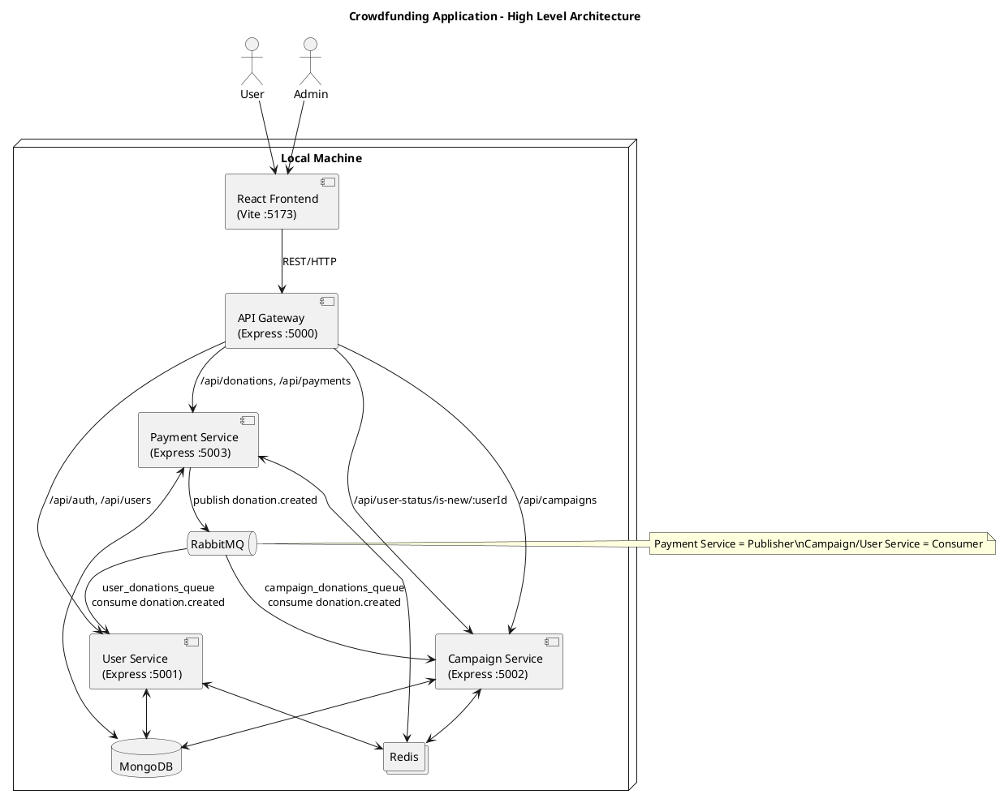
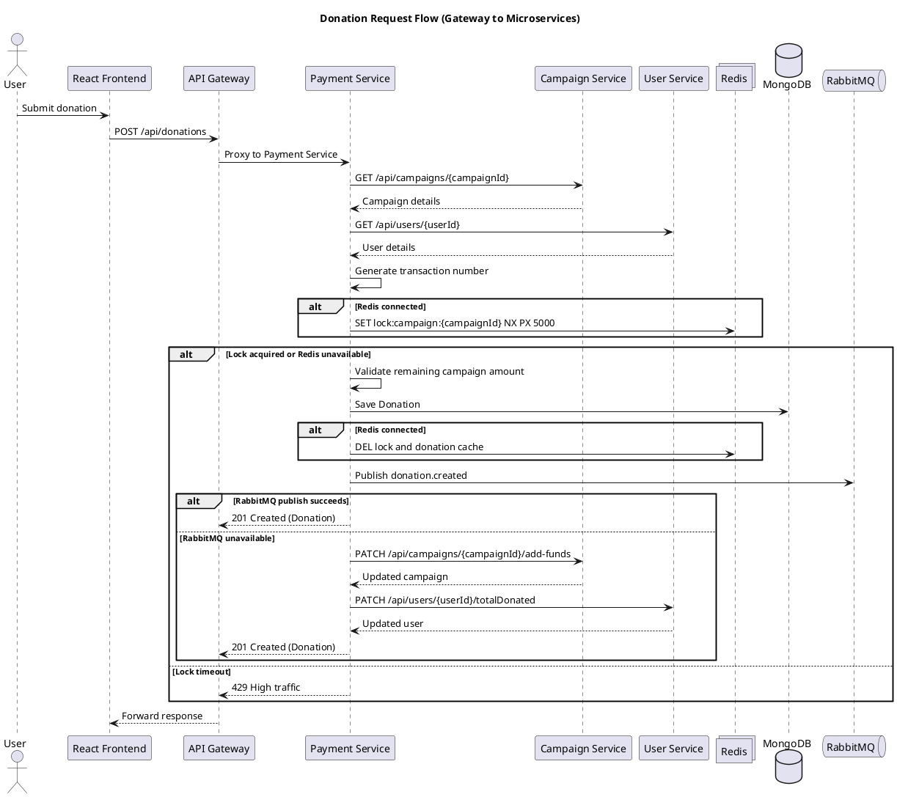
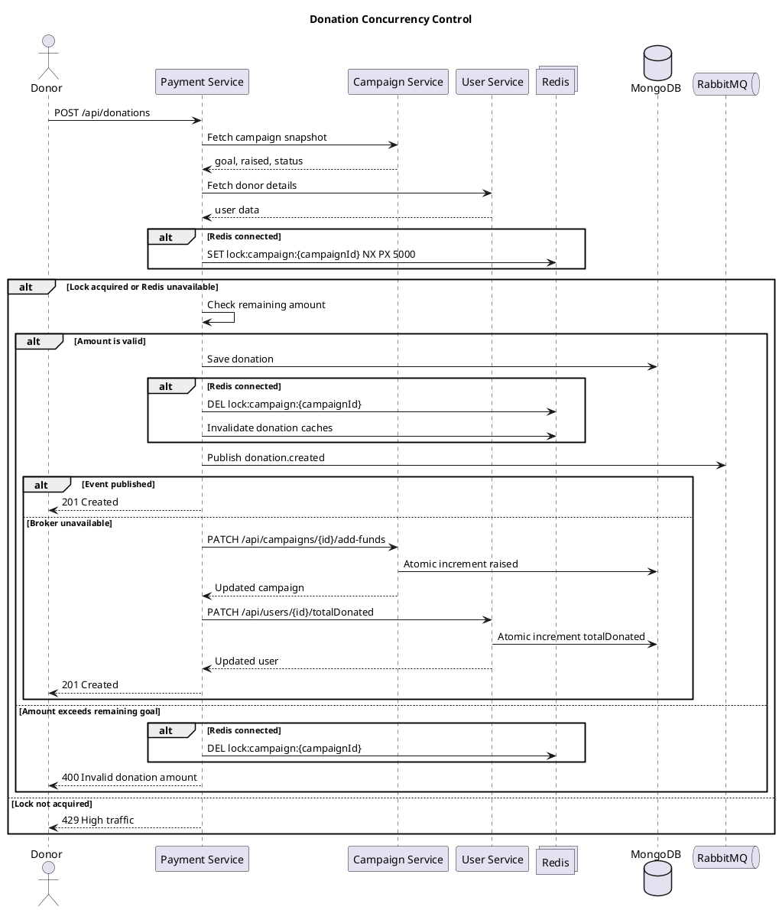
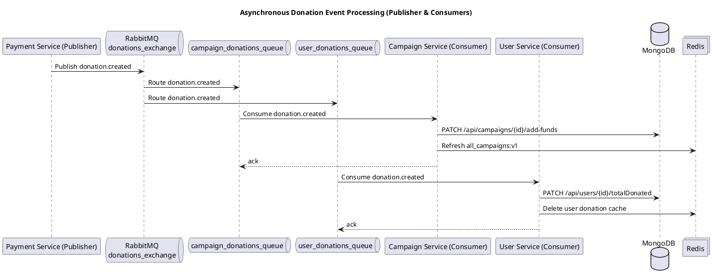
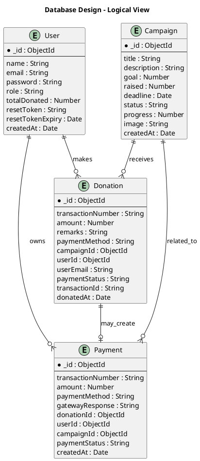
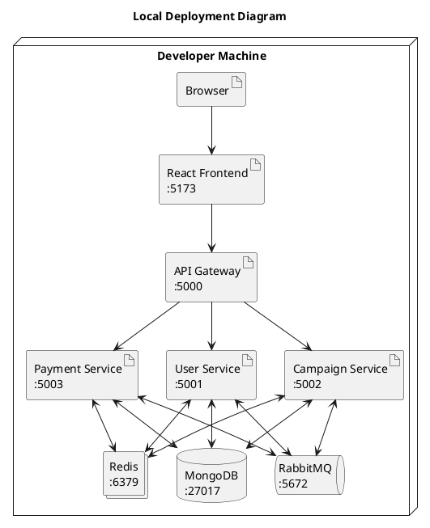

# PAMCA608 - System Design Documentation

**Course:** PAMCA608 - System Design  
**Term:** Winter 2025-26  
**Application:** Crowdfunding Application with Transaction Safety
**Stack:** MERN Stack with Microservices Architecture

## Project Title

Crowdfunding Application Using MERN Stack and Microservices Architecture

## Problem Statement

Using a MERN stack application, this project analyzes system requirements, identifies major services and their responsibilities, and implements the business logic using a microservices architecture. The design addresses inter-service communication, concurrency control and consistency handling, caching mechanisms, event-driven messaging, and asynchronous processing.

## Abstract

This project is a locally deployed crowdfunding platform built using the MERN stack, with React for the frontend, Node.js and Express for the backend services, and MongoDB for persistent data storage. The application solves the problem of connecting campaign creators and donors through a single digital platform where users can discover campaigns, contribute funds, and track contribution history while administrators manage campaigns.

The system is implemented using a microservices architecture to separate responsibilities into user, campaign, payment, and gateway services. This separation improves modularity, makes service boundaries explicit, and demonstrates real-world system design concerns such as inter-service communication, distributed consistency, asynchronous processing, and caching.

Key design highlights of the system include:

- API Gateway based request routing
- REST-based service-to-service communication
- Redis-based caching and distributed locking
- RabbitMQ-based event-driven messaging with asynchronous consumers
- Atomic database updates for consistency
- Local-machine deployment suitable for academic demonstration and testing

## 1. Introduction

### 1.1 Background of the Problem

Crowdfunding platforms allow individuals, startups, and communities to raise funds from many contributors over a digital platform. Traditional funding channels are often slow, centralized, or inaccessible to small-scale innovators. A web-based crowdfunding system helps solve this by allowing campaigns to be created, published, and funded in a transparent and trackable way.

### 1.2 Need for the System

The need for this system arises from the requirement to:

- provide a simple interface for creating and exploring fundraising campaigns
- support session-based user login and logout
- track donations and campaign funding progress accurately
- handle multiple backend responsibilities in a modular and scalable way
- demonstrate microservices concepts in a MERN-based academic project

### 1.3 Scope of the Application

This application supports:

- user registration and authentication
- frontend route protection for normal users and administrators
- campaign browsing and search
- campaign creation and updates by administrators
- donation creation and a separate payment record API
- donation history tracking
- local deployment on a single machine using multiple backend services

The current scope is focused on development and demonstration in a local environment rather than production-grade internet deployment.

### 1.4 Objectives

The objectives of the project are:

- design a crowdfunding platform using microservices
- implement the system using MERN technologies
- demonstrate inter-service communication using REST and an API gateway
- handle concurrency and consistency in donation workflows
- apply caching and event-driven messaging
- document architecture and deployment for local execution

### 1.5 Overview of MERN Stack

The project uses the MERN stack:

- MongoDB: document-oriented NoSQL database for storing users, campaigns, donations, and payments
- Express.js: backend framework for exposing REST APIs
- React: frontend library for building the user interface
- Node.js: runtime used to execute backend services and the frontend toolchain

## 2. System Requirements Analysis

### 2.1 Functional Requirements

The functional requirements supported by the current codebase are:

- user registration with name, email, and password
- user login and logout using session cookies
- current-session restoration through `/api/auth/me`
- forgot-password reset flow using email and new password
- campaign creation by admin
- campaign update by admin
- campaign cancellation by admin
- list all campaigns
- view a single campaign
- browse campaigns through featured, latest, trending, and all views
- search campaigns by title or description
- create donation entries for a campaign
- provide a payment record API after donation creation
- fetch donation history globally or by user
- show user dashboard with total donations and donation history
- show admin dashboard with campaign management and transaction history

### 2.2 Non-Functional Requirements

The major non-functional requirements addressed in this implementation are:

- Scalability:
  The microservice split allows each service to evolve independently.
- Performance:
  Redis is used to cache campaign and donation reads.
- Availability:
  RabbitMQ failure does not fully stop the donation workflow because HTTP fallback is implemented.
- Reliability:
  Atomic database updates and cache invalidation reduce inconsistent results.
- Consistency:
  Donation processing uses database increments and distributed locking to reduce race conditions.
- Fault Tolerance:
  The system continues to function even when Redis or RabbitMQ are unavailable, although with reduced optimization.
- Security:
  Cookie-based sessions and frontend route checks are implemented for local demonstration. Password hashing, HTTPS, and backend authorization middleware are listed as production improvements.

### 2.3 Assumptions and Constraints

Assumptions:

- the entire application runs on a single local machine
- MongoDB, Redis, and RabbitMQ are available locally
- the frontend accesses backend services only through the API gateway
- users and admins use modern browsers on the same local network or machine

Constraints:

- service ports are fixed in the current implementation
- passwords are stored in plain text in the current code
- secure HTTPS and production hardening are not implemented
- service discovery is static and based on localhost URLs

## 3. System Architecture Design

### 3.1 Overall Architecture

The system follows a client-server model with a microservices-based backend. The browser communicates with the React frontend. The frontend sends HTTP requests to the API Gateway. The API Gateway routes requests to dedicated backend services:

- User Service
- Campaign Service
- Payment Service

Supporting infrastructure components include:

- MongoDB for persistent storage
- Redis for caching and distributed locking
- RabbitMQ for asynchronous event delivery

Deployment mode:

- local deployment only
- all components run on a single machine using different ports

### 3.2 Architecture Diagram



### 3.3 Technology Stack

- Frontend: React, Vite, React Router, Axios
- Backend: Node.js, Express
- Database: MongoDB with Mongoose
- API Gateway: Express with `http-proxy-middleware`
- Message Broker: RabbitMQ with `amqplib`, topic exchanges, durable queues, and confirmed publishing
- Cache and Locking: Redis
- Session Handling: `cookie-session`

## 4. Identification of Microservices and Responsibilities

### 4.1 API Gateway

Responsibilities:

- acts as the single browser-facing backend entry point
- routes requests to the appropriate microservice
- handles CORS for the local frontend
- logs request and proxy timing information

Routes handled:

- `/api/auth` -> user service
- `/api/users` -> user service
- `/api/campaigns` -> campaign service
- `/api/donations` -> payment service
- `/api/payments` -> payment service
- `/api/user-status/is-new/:userId` -> campaign service

### 4.2 User Service

Responsibilities:

- user registration
- user login and logout
- session restoration
- forgot password handling
- user retrieval
- tracking cumulative donated amount
- fetching donation history for a user from payment service

### 4.3 Campaign Service

Responsibilities:

- create campaigns
- update campaigns
- cancel campaigns
- retrieve campaign lists and campaign details
- update raised amount when donations are processed
- calculate and maintain campaign status and progress
- provide a campaign donation-history route that delegates to the payment service
- cache campaign lists in Redis

### 4.4 Payment Service

Responsibilities:

- create donation entries
- validate donation amount against campaign state
- generate transaction numbers and transaction identifiers
- expose APIs for creating payment records
- lock campaign donation processing using Redis
- publish donation events to RabbitMQ
- fall back to synchronous HTTP updates if messaging is unavailable

## 5. Inter-Service Communication

The project uses two communication styles:

- synchronous communication using REST APIs
- asynchronous communication using RabbitMQ messages

### 5.1 REST-Based Communication

Examples from the codebase:

- Payment Service calls Campaign Service to fetch campaign details before donation creation
- Payment Service calls User Service to fetch donor details before donation creation
- User Service calls Payment Service to fetch donation history for a specific user
- Campaign Service has a route that delegates campaign donation-history lookup to Payment Service
- API Gateway forwards frontend requests to the correct service

Internal REST calls currently use fixed localhost URLs, which is suitable for the current local deployment model.

### 5.2 API Gateway Usage

The API Gateway centralizes browser communication and hides internal service ports from the frontend. This improves maintainability because the React application can be configured with a single base URL, `VITE_API_URL`, instead of directly managing three backend URLs.

### 5.3 PlantUML Sequence for Request Flow



## 6. Concurrency Control and Consistency Handling

Concurrency control is especially important in the donation workflow because multiple donors may attempt to donate to the same campaign at the same time.

### 6.1 Redis Distributed Lock

The Payment Service creates a Redis lock using a key of the form:

- `lock:campaign:{campaignId}`

This lock is acquired before the critical donation write. If the lock is already held, the service retries briefly. If the lock cannot be acquired within the retry limit, the request is rejected with a rate-limit style response.

This reduces the risk of two donations simultaneously overshooting the remaining campaign goal.

### 6.2 Atomic Database Updates

The application uses MongoDB atomic increment operations in:

- `PATCH /api/campaigns/:id/add-funds`
- `PATCH /api/users/:id/totalDonated`

These operations use `$inc`, which prevents read-modify-write race conditions when updating totals.

### 6.3 Atomic Update Endpoints

Important consistency endpoints:

- `PATCH /api/campaigns/:id/add-funds`
  Increments the campaign's raised amount and recalculates progress/status.
- `PATCH /api/users/:id/totalDonated`
  Increments the user's cumulative donated amount.
- `POST /api/donations`
  Validates campaign and user existence, checks the remaining campaign amount, saves the donation, invalidates caches, and publishes the donation event.

### 6.4 Consistency Model

The system uses a practical hybrid consistency approach:

- immediate consistency within a service transaction where possible
- eventual consistency across services through RabbitMQ
- fallback synchronous updates when RabbitMQ is unavailable

This means the system prioritizes availability for local execution while still aiming for correct totals and progress.

### 6.5 PlantUML Sequence for Concurrency Handling



## 7. Caching Mechanism

Redis is used as the cache layer for improving read performance.

### 7.1 Cached Data

The following cached items are visible in the code:

- all campaigns list:
  `all_campaigns:v1`
- all donation history:
  `donations_all:v1`
- donations by user:
  `donations_user_{userId}:v1`
- donations by email:
  `donations_email_{email}:v1`
- user donation history lookup:
  `user:{userId}:donations:v1`

### 7.2 Caching Strategy

The application uses a cache-aside strategy:

1. check Redis first
2. if cache miss occurs, query MongoDB or another service
3. return the response
4. populate Redis in the background or immediately after the read

### 7.3 Cache Invalidation

Cache invalidation occurs after write operations such as:

- creating a new donation
- updating campaign totals
- updating a user's donated total
- creating or editing campaigns

This helps avoid stale results in dashboards and explore pages.

### 7.4 Impact on Local Deployment

Even in a local single-machine setup, caching demonstrates reduced read latency and models real-world architectural practice. If Redis is unavailable, the application still works by directly querying the database or calling downstream services.

## 8. Event-Driven Messaging and Asynchronous Processing


RabbitMQ is used to decouple services after a donation is created, enabling asynchronous event-driven updates across microservices.

### 8.1 Event Publisher (Producer)

**Payment Service (Publisher):**
- Publishes donation-related events after a donation is saved.
- Main event: `donation.created` (sent to the `donations_exchange` topic exchange with the `donation.created` routing key).
- Uses a confirm channel and batching for reliability.

#### Publisher Responsibilities:
- After a donation is created and stored, the Payment Service emits a `donation.created` event.
- If RabbitMQ is unavailable, it falls back to direct HTTP PATCH calls to update other services synchronously.

### 8.2 Event Consumers

**Campaign Service (Consumer):**
- Subscribes to the `campaign_donations_queue`.
- On receiving a `donation.created` event, it updates the campaign's raised amount and progress in MongoDB.
- Refreshes campaign cache in Redis.

**User Service (Consumer):**
- Subscribes to the `user_donations_queue`.
- On receiving a `donation.created` event, it updates the user's cumulative donated amount in MongoDB.
- Invalidates user donation cache in Redis.

#### Consumer Responsibilities:
- Listen for relevant events from RabbitMQ queues.
- Update local state (database and cache) based on event payloads.
- Acknowledge message processing to RabbitMQ.

**Other Event Paths:**
- The system also defines a `users_exchange` and `user.registered` event path (currently a placeholder for future features like profile initialization or notifications).

### 8.3 Benefits of Asynchronous Messaging

- Reduces tight coupling between services (services do not need to know each other's endpoints for updates).
- Supports eventual consistency across distributed services.
- Keeps the Payment Service focused on transaction creation.
- Makes the system easier to extend with more consumers later (e.g., analytics, notifications).

### 8.4 Fallback Behavior

If RabbitMQ is not available, the Payment Service switches to synchronous HTTP calls:

- `PATCH /api/campaigns/:id/add-funds`
- `PATCH /api/users/:id/totalDonated`

This design improves availability in local deployment and ensures the main workflow still completes.

### 8.5 PlantUML Sequence for Event-Driven Processing



## 9. Database Design

MongoDB is used as the persistent storage system. The application models data using Mongoose schemas.

### 9.1 Collections

The primary collections are:

- `users`
- `campaigns`
- `donations`
- `payments`

### 9.2 User Collection

Important fields:

- `name`
- `email`
- `password`
- `role`
- `totalDonated`
- `createdAt`

### 9.3 Campaign Collection

Important fields:

- `title`
- `description`
- `goal`
- `raised`
- `deadline`
- `status`
- `progress`
- `image`
- `createdAt`

### 9.4 Donation Collection

Important fields:

- `transactionNumber`
- `amount`
- `remarks`
- `paymentMethod`
- `campaignId`
- `userId`
- `userEmail`
- `paymentStatus`
- `transactionId`
- `donatedAt`

### 9.5 Payment Collection

Important fields:

- `transactionNumber`
- `amount`
- `paymentMethod`
- `gatewayResponse`
- `paymentStatus`
- `donationId`
- `userId`
- `campaignId`
- `createdAt`

### 9.6 PlantUML ER-Style View



## 10. API Design

All browser-facing API calls are made through the API Gateway on `http://localhost:5000`.

### 10.1 Authentication APIs

- `POST /api/auth/register`
- `POST /api/auth/login`
- `POST /api/auth/logout`
- `GET /api/auth/me`
- `POST /api/auth/forgot-password`

### 10.2 User APIs

- `GET /api/users`
- `GET /api/users/:id`
- `GET /api/users/:id/donations`
- `POST /api/users`
- `PATCH /api/users/:id/totalDonated`

### 10.3 Campaign APIs

- `GET /api/campaigns`
- `GET /api/campaigns/:id`
- `GET /api/campaigns/:id/donations`
- `POST /api/campaigns`
- `PUT /api/campaigns/:id`
- `POST /api/campaigns/:id/cancel`
- `PATCH /api/campaigns/:id/add-funds`

Note: `GET /api/campaigns/:id/donations` delegates to the Payment Service. The current Payment Service donation listing supports global, `userId`, and `userEmail` filters; campaign-specific filtering is a recommended improvement.

### 10.4 Payment and Donation APIs

- `GET /api/donations`
- `GET /api/donations/:id`
- `POST /api/donations`
- `GET /api/payments`
- `GET /api/payments/:id`
- `POST /api/payments`

### 10.5 API Characteristics

- JSON-based payload exchange
- RESTful URI structure
- localhost-based service communication
- response codes for success and error cases
- browser requests routed through the gateway
- synchronous REST for validation and fallback updates
- asynchronous events for post-donation campaign and user total updates

## 11. Implementation Details

### 11.1 Frontend

The frontend is built with React and Vite. Major files and responsibilities include:

- `src/App.jsx`
  Defines the main route structure.
- `src/context/AuthContext.jsx`
  Manages session restoration, login state, and logout flow.
- `src/context/CampaignContext.jsx`
  Manages campaign and donation state shared across pages.
- `src/services/campaignService.js`
  Centralizes frontend HTTP calls to the backend gateway.
- `src/pages/Home.jsx`
  Landing page with hero section and campaign discovery links.
- `src/pages/Explore.jsx`
  Campaign listing, search, and featured/trending/latest views.
- `src/pages/Dashboard.jsx`
  User donation history and contribution summary.
- `src/pages/Admin.jsx`
  Campaign creation, campaign editing, and donation transaction history.

### 11.2 Backend

The backend is composed of separate Node.js services:

- `microservices/api-gateway/server.js`
  Gateway proxy for all frontend-facing API requests.
- `microservices/user-service`
  Authentication, user management, total donated updates.
- `microservices/campaign-service`
  Campaign CRUD, status handling, caching.
- `microservices/payment-service`
  Donation processing, payment creation, concurrency control.

### 11.3 Database

MongoDB is accessed through Mongoose models:

- `User`
- `Campaign`
- `Donation`
- `Payment`

Each service manages the collections relevant to its business logic while still sharing the same local MongoDB instance.

## 12. Deployment and Execution

### 12.1 Deployment Model

This project is designed for local deployment only. All components run on the same machine with fixed localhost ports.

### 12.2 Local Ports

- Frontend: `5173`
- API Gateway: `5000`
- User Service: `5001`
- Campaign Service: `5002`
- Payment Service: `5003`

### 12.3 Required Local Software

- Node.js 18+
- npm
- MongoDB
- Redis
- RabbitMQ

### 12.4 Environment Configuration

The project uses environment variables from a root `.env` file. A local configuration can follow this structure:

```env
MONGO_URI=mongodb://127.0.0.1:27017/crowdfunding
PORT=5000
VITE_API_URL=http://localhost:5000
SESSION_SECRET=cf-session-secret
REDIS_URL=redis://127.0.0.1:6379
RABBITMQ_URL=amqp://localhost
USER_SERVICE_URL=http://localhost:5001
CAMPAIGN_SERVICE_URL=http://localhost:5002
```

### 12.5 Installation

```bash
npm install
```

### 12.6 Running the Project

Option 1:

```bash
npm run microservices
```

Option 2:

```bat
start-all.bat
```

Note: `npm run microservices` is the preferred startup command when using the root `.env` file. The `start-all.bat` script starts each service from its own folder, so root `.env` values may need to be supplied as shell-level environment variables unless the default local configuration is enough.

### 12.7 Typical Local Startup Sequence

1. Start MongoDB.
2. Start Redis.
3. Start RabbitMQ.
4. Run `npm install` if dependencies are not installed.
5. Run `npm run microservices`.
6. Open `http://localhost:5173`.

### 12.8 PlantUML Deployment Diagram



## 13. Conclusion

This crowdfunding application demonstrates how a MERN-based system can be designed using microservices for clearer separation of concerns and improved architectural flexibility. The implementation addresses all major requirements of the problem statement: inter-service communication, concurrency control, consistency handling, caching, and event-driven asynchronous processing.

For the current academic scope, the system is intentionally optimized for local deployment on a single machine. Even within this local setup, the project demonstrates several production-inspired design practices such as API gateway routing, Redis locking, cache-aside reads, message-driven updates, and graceful fallback strategies.

The project can be extended further with stronger authentication, password hashing, containerized deployment, monitoring, centralized configuration, and production-grade security controls.

## Appendix A: Source Structure

```text
CROWD-FUNDING-APPLICATION/
|- .env
|- .gitattributes
|- .gitignore
|- eslint.config.js
|- index.html
|- microservices/
|  |- api-gateway/
|  |  |- server.js
|  |- campaign-service/
|  |  |- config/
|  |  |  |- db.js
|  |  |- models/
|  |  |  |- Campaign.js
|  |  |- routes/
|  |  |  |- campaigns.js
|  |  |- services/
|  |  |  |- campaignService.js
|  |  |- rabbitmq.js
|  |  |- redis.js
|  |  |- seedAdmin.js
|  |  |- server.js
|  |- payment-service/
|  |  |- config/
|  |  |  |- db.js
|  |  |- models/
|  |  |  |- Donation.js
|  |  |  |- Payment.js
|  |  |- routes/
|  |  |  |- donations.js
|  |  |  |- payments.js
|  |  |- utils/
|  |  |  |- generateTransactionNumber.js
|  |  |- rabbitmq.js
|  |  |- redis.js
|  |  |- seedAdmin.js
|  |  |- server.js
|  |- user-service/
|  |  |- config/
|  |  |  |- db.js
|  |  |- models/
|  |  |  |- User.js
|  |  |- routes/
|  |  |  |- auth.js
|  |  |  |- users.js
|  |  |- services/
|  |  |  |- userService.js
|  |  |- rabbitmq.js
|  |  |- redis.js
|  |  |- seedAdmin.js
|  |  |- server.js
|- package-lock.json
|- package.json
|- README.md
|- src/
|  |- assets/
|  |  |- image.png
|  |  |- image2.png
|  |  |- image3.png
|  |  |- image4.png
|  |- Components/
|  |  |- CampaignCard.css
|  |  |- CampaignCard.jsx
|  |  |- Navbar.css
|  |  |- Navbar.jsx
|  |  |- ProgressBar.jsx
|  |  |- ProtectedRoute.jsx
|  |- context/
|  |  |- AuthContext.jsx
|  |  |- CampaignContext.jsx
|  |- pages/
|  |  |- Admin.css
|  |  |- Admin.jsx
|  |  |- Auth.css
|  |  |- Auth.jsx
|  |  |- Campaign.jsx
|  |  |- Dashboard.css
|  |  |- Dashboard.jsx
|  |  |- Donate.jsx
|  |  |- Explore.css
|  |  |- Explore.jsx
|  |  |- Home.css
|  |  |- Home.jsx
|  |  |- Payment.css
|  |  |- Payment.jsx
|  |- services/
|  |  |- campaignService.js
|  |- App.jsx
|  |- main.jsx
|- start-all.bat
|- vite.config.js
```

## Appendix B: Important Notes About the Current Implementation

- The project is suitable for local deployment only.
- Passwords are currently stored in plain text and should be hashed in a production system.
- Service addresses are hardcoded to localhost in several backend calls.
- CORS is currently configured for `http://localhost:5173`.
- Redis and RabbitMQ improve the design, but the application also contains fallback behavior to keep local execution simple.
- The payment flow simulates successful payment records rather than integrating a real external payment gateway.
